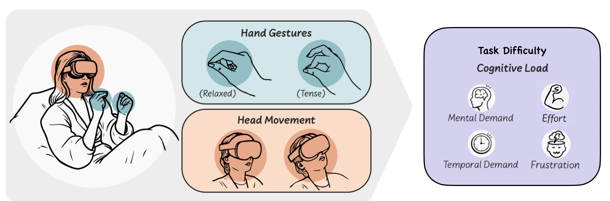
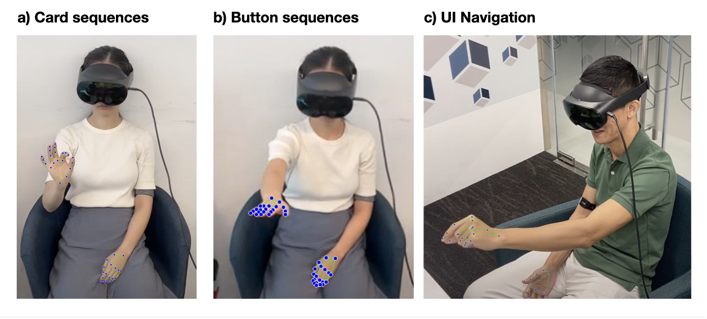

# Motion as Emotion

**Detecting Affect and Cognitive Load from Free-Hand Gestures in VR**



This repository contains the Unity data-collection tool used in the paper *Motion as Emotion: Detecting Affect and Cognitive Load from Free-Hand Gestures in VR*. The project runs a set of free-hand VR tasks on the Meta Quest Pro and logs the head, hand and finger motion needed to study how affect and cognitive load are reflected in the way people move.

- **Paper:** [arXiv:2409.12921](https://arxiv.org/abs/2409.12921)
- **Authors:** Phoebe Chua, Prasanth Sasikumar, Yadeesha Weerasinghe, Suranga Nanayakkara
- **Lab:** [Augmented Human Lab](https://ahlab.org), National University of Singapore

## About the project

Systems that can sense a user's emotional state and cognitive load can respond more intelligently, but most existing methods rely on cameras, microphones or wearable sensors. Motion as Emotion proposes a different approach: use the fine differences in hand motion that already occur during common free-hand VR interactions to infer affect and cognitive load, without any additional hardware or modifications to a standard VR headset.

In a study with 22 participants, we collected hand and head-tracking data while people performed VR tasks of varying difficulty. We found that the affect and cognitive load induced by the tasks are associated with significant differences in gesture features such as speed, distance and hand tension. Notably, participants displayed increased hand tension and reduced head movement when engaging in more challenging tasks. Standard support vector classification (SVC) models trained on these features could predict two levels (low, high) of valence, arousal and cognitive load.



## Tasks

Each participant completed four interaction tasks in both an easy and a challenging condition, plus a baseline scene. The tasks were designed to induce different levels of valence, arousal and cognitive load, and each was standardized to one minute.

| Task | Scene | Interaction | Designed to elicit |
| --- | --- | --- | --- |
| Slingshot | `slingshot.unity` | Grab and fire a slingshot to knock down cups | Fun and enjoyment |
| Card sequence memorization | `SequenceGame.unity`, `iTiles.unity` | Recall a highlighted sequence using a pinch-driven virtual pointer | High cognitive load and stress |
| Button sequence memorization | `SequenceGame.unity` | Recall a highlighted sequence by pressing physical-style buttons with the virtual hand | High cognitive load and stress |
| UI navigation | `UI_Navigation.unity` | Swipe through a multi-page menu to find highlighted cards | Frustration |
| Baseline | `baseline.unity` | A calming starry-night scene with soft music | Resting heart rate and HRV |

## What gets recorded

The tool logs three kinds of data during each task:

- **Motion tracking:** 3D positions and orientations of the head and of 21 joints on each hand, plus estimated pinch strength, sampled at 20 Hz through the Meta Quest Pro's tracking systems (`SaveJointsToCSV.cs`, `SaveBodyDataToCSV.cs`).
- **Subjective self-reports:** valence and arousal via the Affective Slider, and cognitive load via the mental demand, temporal demand and frustration subscales of the NASA-TLX (collected after each task).
- **Physiological data:** heart rate and heart rate variability, captured separately with a Polar Verity Sense optical heart rate monitor.

## Requirements

- Unity **2022.3.35f1** (as specified in `ProjectSettings/ProjectVersion.txt`)
- A Meta Quest Pro headset with hand tracking enabled
- Oculus / Meta XR and Unity XR packages (included via the Unity Package Manager, see `Packages/manifest.json`)
- [Blockade Labs SDK](https://www.blockadelabs.com) for the generated skybox in the baseline scene

## Getting started

1. Clone the repository.
2. Open the project with Unity 2022.3.35f1. Let the Package Manager resolve the dependencies listed in `Packages/manifest.json`.
3. Connect a Meta Quest Pro and enable hand tracking.
4. Open a task scene from `Assets/Scenes/` (for example `slingshot.unity`) and press Play, or build to the headset.
5. Logged CSV files are written by the `SaveJointsToCSV` and `SaveBodyDataToCSV` components attached in each scene.

## Project layout

- `Assets/Scenes/` VR task scenes (slingshot, sequence game, UI navigation, baseline and trial scenes)
- `Assets/Scripts/` gameplay and data-logging scripts, including the CSV loggers and per-task managers
- `Packages/` Unity package manifest and lock file
- `ProjectSettings/` Unity project configuration

## Citation

If you use this tool or build on the work, please cite:

```bibtex
@article{chua2024motion,
  title   = {Motion as Emotion: Detecting Affect and Cognitive Load from Free-Hand Gestures in VR},
  author  = {Chua, Phoebe and Sasikumar, Prasanth and Weerasinghe, Yadeesha and Nanayakkara, Suranga},
  journal = {arXiv preprint arXiv:2409.12921},
  year    = {2024}
}
```

## License

Released under the [MIT License](LICENSE).
